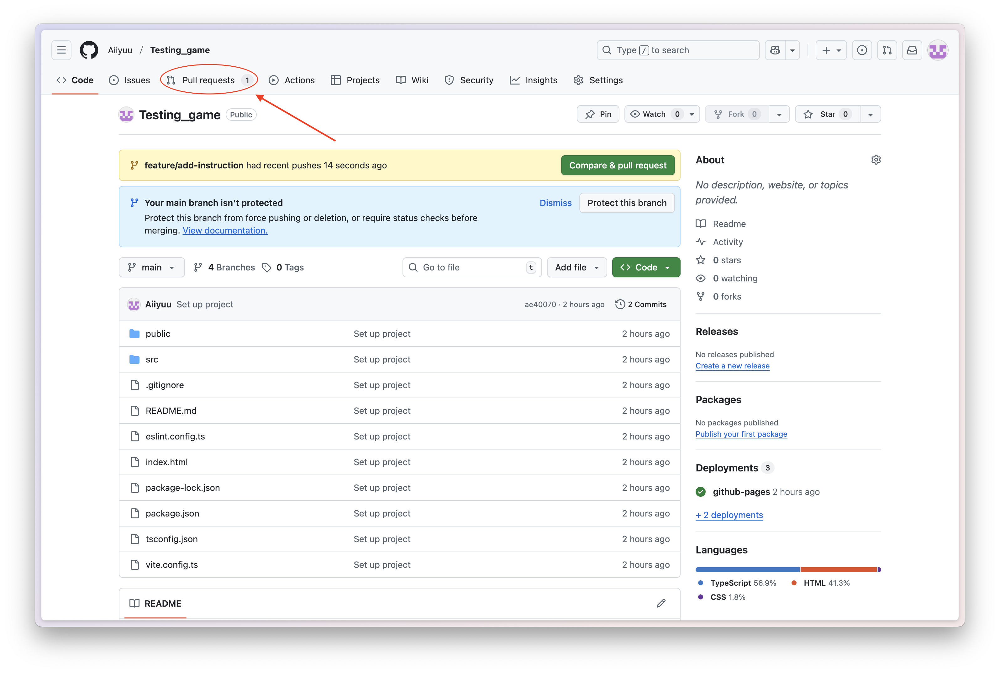
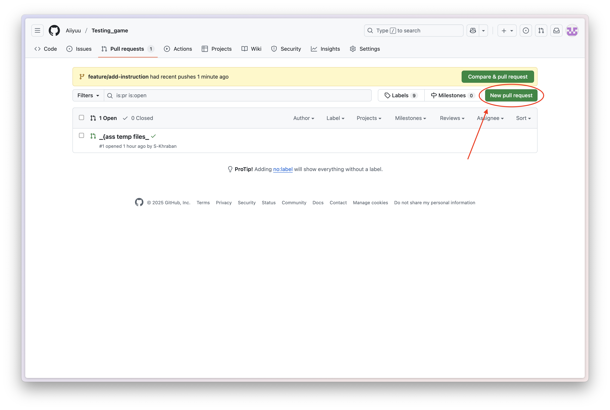
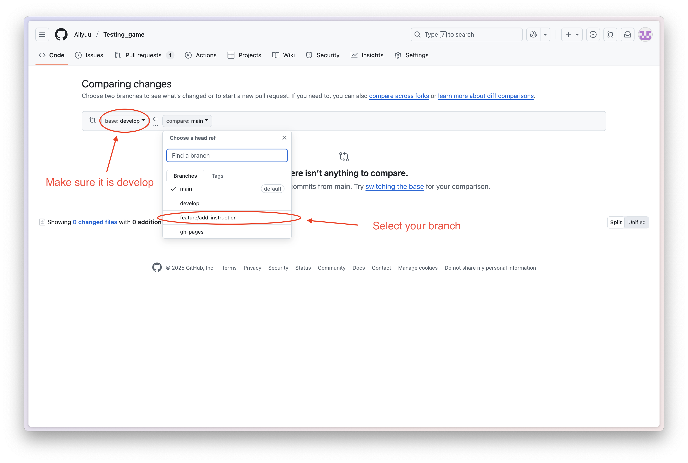
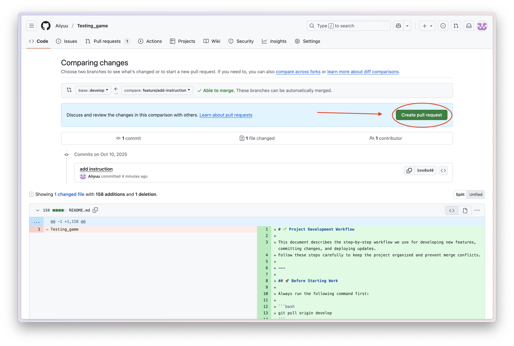

# 🌱 Project Development Workflow

This document describes the step-by-step workflow we use for developing new features, committing changes, and deploying updates.  
Follow these steps carefully to keep the project organized and prevent merge conflicts.

---

## 🚀 Before Starting Work

Always run the following command first:

```bash
git pull origin develop
```

> This command downloads the latest changes from the `develop` branch on GitHub and updates your local copy.
> This ensures that if either of us made changes, they will appear on your computer.

---

## 🌿 When you want to add something new to the game

You need to create a new branch:

```bash
git checkout -b feature/<feature_description>
```

> Explanation:
>
> - `git checkout` — switches between branches in your project.
> - The flag `-b` tells Git to create a new branch and immediately switch to it.
> - The branch name should describe what you’re working on.

### 🔍 Examples:

```bash
git checkout -b feature/map
git checkout -b feature/welcome-menu
git checkout -b feature/player-movement
```

---

## 🛠 After making changes

```bash
npm run lint
```

> Runs ESLint to fix code formatting and style issues.

```bash
git add .
```

> Adds all modified files to the “staging area,” preparing them for a commit.

```bash
git commit -m "Your commit message"
```

> Saves your changes locally with a message describing what you did.

## 📤 Push your changes to GitHub

```bash
git push origin <branch_name>
```

> Uploads your branch to GitHub.

### 🔍 Examples:

```bash
git push origin feature/map
git push origin feature/welcome-menu
git push origin feature/player-movement
```

---

## 🔁 Create a Pull Request (PR)

After pushing your branch to GitHub:

- Go to your repository.
- Open the **“Pull requests”** tab.
- Click **“New pull request.”**
- In the **first column**, select the `develop` branch — this is our main branch.
- In the **second column**, select your branch.
- Click **“Create pull request.”**

After pushing your branch:

1. Go to your repository on GitHub.
2. Open the **"Pull requests"** tab.  
   

3. Click **"New pull request"**.  
   

4. In the **first column**, select `develop` — this is the main development branch.  
   In the **second column**, select your feature branch.  
   

5. Click **"Create pull request"** and write a short description.  
   

---

## After merging your branch into develop

You can safely delete your local and remote feature branches.

```bash
git checkout develop
```

> Switches back to the `develop` branch on your computer.

```bash
git pull origin develop
```

> Updates your local `develop` branch with the latest changes from GitHub.

---

## 🧹 Delete your feature branch

```bash
git push origin --delete <branch_name>
```

> Deletes the branch from the **remote repository** (on GitHub).

### 🔍 Examples:

```bash
git push origin --delete feature/map
git push origin --delete feature/welcome-menu
git push origin --delete feature/player-movement
```

```bash
git branch -D <branch_name>
```

> Deletes the branch from your **local machine**.

### 🔍 Examples:

```bash
git branch -D feature/map
git branch -D feature/welcome-menu
git branch -D feature/player-movement
```

---

## 🌍 If you want to deploy the changes

```bash
npm run build
```

> Builds your project for production.

```bash
npm run deploy
```

> Deploys your built project to the hosting server.
