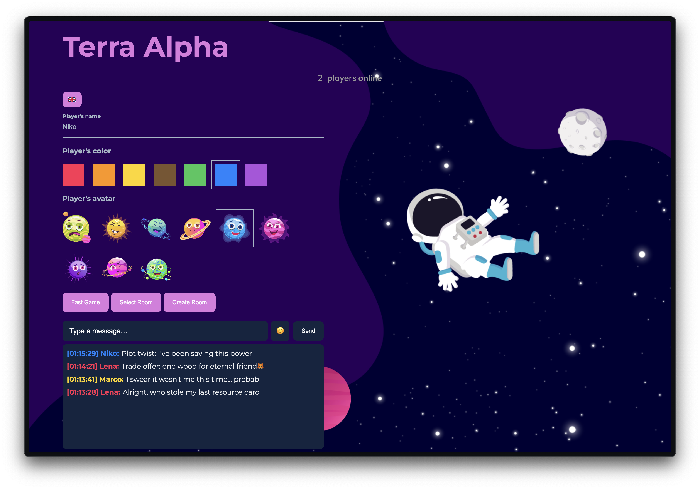
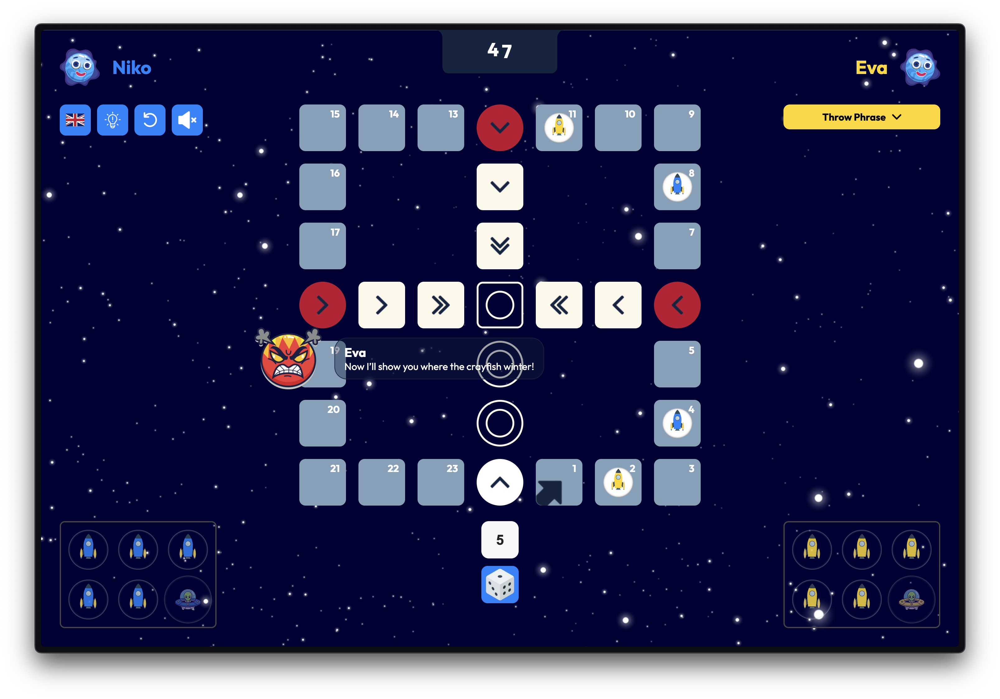

# 🌌 TerraAlpha

**TerraAlpha** is a cosmic-themed **board game** set in the depths of space, where players compete for dominance across distant galaxies and unknown worlds.

Inspired by **“Кози Вівці”**, a board game created by **[Serhiy Khraban](https://s-khraban.github.io/)**, this project brings interstellar strategy and adventure to your browser. 

> 🚀 Play the live demo here: https://aiiyuu.github.io/TerraAlpha/

---

## Game Overview 🌌🚀

**TerraAlpha** is an online **space-themed board game** where players race to move all their ships from **start** to **finish** across the galaxy. The first commander to successfully guide all their ships wins the match! 🌠

Challenge your friends in **two-player rooms** or join a **Fast Game** to jump straight into interstellar action. The game is packed with features to enhance your experience:
🛰️ Create or join rooms
💬 Chat globally or privately with your opponent
🔇 Mute sounds and music
🧭 Enable or disable gameplay helpers
🔁 Offer a restart mid-game
🌍 Choose from multiple languages

Strategize, communicate, and outmaneuver your opponent — only the fastest and smartest explorer will claim victory on **TerraAlpha!** 🌌✨

---

## Screenshots 📸

<p align="center">
  
  <em>Main Menu</em>
</p>

<br>

<p align="center">
  
  <em>Game Window</em>
</p>

---

## Features ✨

- **Space Strategy:** Move all your ships from start to finish across the galaxy.
- **Multiplayer Mode:** Play online with a friend — two players per room.
- **Communication:** Chat globally or within your game room.
- **Customization:** Create or join rooms, or start instantly with **Fast Game.**
- **User Control:** Mute sounds or music, toggle helpers, and offer a restart anytime.
- **Multilingual Support:** Enjoy the game in multiple languages for a wider audience.

---

## Tech Stack 🛠️

- **Firebase Realtime Database:** Powers online multiplayer features, including live rooms, chat, and game synchronization.
- **HTML:** Provides the structural foundation of the game interface.
- **CSS:** Handles visual styling, ensuring a clean and responsive design.
- **TypeScript:** Manages game logic, player interactions, and overall state control.
- **Canvas:** Used for rendering dynamic effects such as fireworks during celebrations.
- **Confetti.js:** Adds festive visual effects for victories and events.
- **emoji-picker-element:** Enables expressive communication with emojis in the chat.

---

## Installation ⚙️

### Prerequisites 📋
Make sure you have the following installed:

- **Node.js** (latest stable version)
- **npm**

### 1. Clone the Repository
Open your terminal and run:
```bash
git clone https://github.com/Aiiyuu/TerraAlpha/tree/main
```

```bash
cd TerraAlpha
```

### 2. Install Dependencies
Run the following command to install all required packages:
```bash
npm install
```

### 3. Start the Development Server
Launch the game locally with:
```bash
npm run dev
```

> Make sure you have [Node.js](https://nodejs.org/) installed.

The game will now be available at [http://localhost:5173](http://localhost:5173/TerraAlpha/) or another available port.

---

## How to Play 🎮

### Мені потрібно щоб ти мені тут поміг щось написати
### Можна ще добавити секцію Game Mechanics ⚡

---

Made with ❤️ in cooperation by **[Serhiy Khraban](https://s-khraban.github.io/)** and **[Nazariy Holovach](https://aiiyuu.github.io/nazariyholovach-portfolio/)**.
